# **Tài liệu nghiên cứu Apollo GraphQL**

> ### _Phần code và tài liệu của repo này chứa các thông tin tìm hiểu của team về Apollo GraphQL_

<br>

## **Thành viên**

| Họ và tên         | MSSV     | Email                    | \*     |
| ----------------- | -------- | ------------------------ | ------ |
| Lê Phan Công Minh | 18120463 | congminh090800@gmail.com | leader |
| Trần Đại Nghĩa    | 18120480 | mising                   |
| Nguyễn Khắc Luân  | 18120457 | missing                  |

## **Giới thiệu**

GraphQL là ngôn ngữ truy vấn và thao tác với các API, gồm các đặc điểm sau:

- Cho phép client tùy chỉnh luồng dữ liêu trả về đúng với những gì họ cần
- GraphQL cho phép tổng hợp dữ liệu từ nhiều bộ dữ liệu khác nhau trong một request duy nhất
- GraphQL tổ chức dữ liệu theo type thay vì endpoint

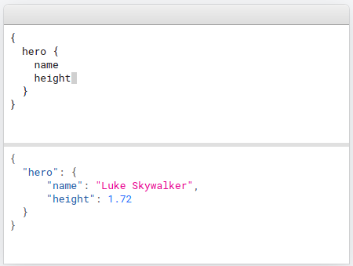
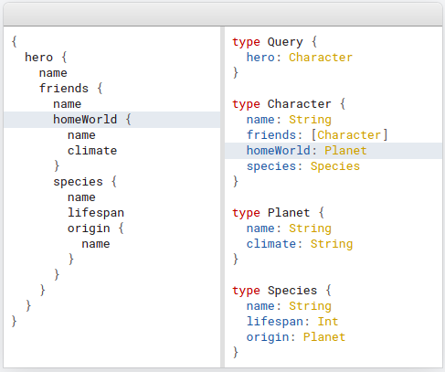

## **Apollo Server**

Apollo Server là một open-source xây dựng dựa trên nền tảng GraphQL Server có thể tích hợp với bất kì GraphQL client nào

Apollo Server có thể được sử dụng như một server riêng biệt hoặc một add-on bên trong một server truyền thống khác

### **Để chạy server demo**

```bash
> cd server
> npm install
> nodemon
```

## 1. Schema

GraphQL cung cấp cho ta một loại ngôn ngữ định nghĩa schema - **schema definition language (or SDL)** khá tương tự với các database schema.

> Khai báo kiểu dữ liệu với cặp `[]` để đánh dấu trường này là một danh sách

> Nullability: khai báo với hậu tố là `!` để đánh dấu trường này là bắt buộc

5 kiểu dữ liệu trong graphql:

- Scalar:
  - Int: A signed 32‐bit integer
  - Float: A signed double-precision floating-point value
  - String: A UTF‐8 character sequence
  - Boolean: true or false
  - ID (serialized as a String): A unique identifier that's often used to refetch an object or as the key for a cache. Although it's serialized as a String, an ID is not intended to be human‐readable.
- Object: bao gồm cả các type đặc biệt như Query, Mutation, Subscription
  - trường `__typename`: tự động thêm vào cho biết type của object
  - Query: type đặc biệt nơi khai báo các entrypoint cho các hành động đọc dữ liệu
  - Mutation: type đặc biệt định nghĩa các entrypoint cho các hành động ghi dữ liệu
  - Subscription: type đặc biệt thông báo mỗi khi server thực hiện hành động được đặt subscription trước đó
- Input: cấu trúc giống object type giúp client cung cấp các data
- Enum: các giá trị của object được định nghĩa sẵn trong schema
- Union and Interface
  - Union: kết hợp 2 schema lại
  - Interface: OOP reference

Ví dụ:

```javascript
const typeDefs = gql`
  type Student {
    id: Int
    class: Class
    email: String
    password: String
    name: String
  }

  type Teacher {
    id: Int
    email: String
    password: String
    name: String
  }

  type Class {
    id: Int
    name: String
    formTeacher: Teacher
    students: [Student]
  }

  input AddStudent {
    email: String
    password: String
    name: String
    classId: Int
  }

  input AddClass {
    name: String
    formTeacherID: Int
  }

  type Query {
    students: [Student]
    teachers: [Teacher]
    classes: [Class]
  }

  type Mutation {
    addClass(name: String, formTeacher: Int): Class
  }
`;
```

- ### Custom scalar type

```javascript
const { GraphQLScalarType, Kind } = require("graphql");

const dateScalar = new GraphQLScalarType({
  name: "Date",
  description: "Date custom scalar type",
  serialize(value) {
    return value.getTime(); // Convert outgoing Date to integer for JSON
  },
  parseValue(value) {
    return new Date(value); // Convert incoming integer to Date
  },
  parseLiteral(ast) {
    if (ast.kind === Kind.INT) {
      return new Date(parseInt(ast.value, 10)); // Convert hard-coded AST string to integer and then to Date
    }
    return null; // Invalid hard-coded value (not an integer)
  },
});
```

## 2. Resolvers

Trước hết, Apollo Server cần biết cách populate data từng field trong từng schema của chúng ta để có thể phản hồi data bất kể "độ sâu" câu truy vấn của bạn là bao nhiêu. Đây là một điểm rất mạnh của graphQL  
Trong ví dụ ta có câu truy vấn sau:

```
query {
  classes {
    students {
      class {
        students {
          name
        }
      }
    }
  }
}
```

Có kết quả:

```json
{
  "data": {
    "classes": [
      {
        "students": [
          {
            "class": {
              "students": [
                {
                  "name": "Acc asklj alsk"
                },
                {
                  "name": "hnim laskdja as"
                }
              ]
            }
          },
          {
            "class": {
              "students": [
                {
                  "name": "Acc asklj alsk"
                },
                {
                  "name": "hnim laskdja as"
                }
              ]
            }
          }
        ]
      },
      {
        "students": [
          {
            "class": {
              "students": [
                {
                  "name": "Le Phan Cong Minh"
                }
              ]
            }
          }
        ]
      },
      {
        "students": []
      },
      {
        "students": []
      }
    ]
  }
}
```

Nhờ resolvers, ta có thể truy vấn một cách "đệ qui" như thế, có thể nói đây là nơi ma thuật xảy ra. Bằng cách khao báo cách populate data cho từng field có type là object nên việc truy vấn với độ sâu lớn không còn là vấn đề

> Note: Resolvers cũng hỗ trợ async/await

### Implementation

```javascript
const resolvers = {
  Student: {
    class: ({ classId }, args, { models }) => {
      const cl = classes.find((ele) => ele.id === classId);
      if (!cl) {
        return null;
      }
      return cl;
    },
  },
  Class: {
    formTeacher: ({ formTeacherId }, args, { models }) => {
      const teacher = teachers.find((ele) => ele.id === formTeacherId);
      if (!teacher) {
        return null;
      }
      return teacher;
    },
    students: (parent, args, { models }) => {
      const student = students.filter((student) =>
        parent.students.includes(student.id)
      );
      return student;
    },
  },
  Query: {
    students: () => students,
    teachers: () => teachers,
    classes: () => classes,
  },
  Mutation: {
    addClass: (parent, args, { models }) => {
      classes.push({
        id: classes.length + 1,
        name: args.name,
        formTeacherId: args.formTeacher,
        students: [],
      });
      return classes[classes.length - 1];
    },
  },
};
```

### Các tham số của một resolver

| Tham số   | Mô tả                                                                                                       |
| --------- | ----------------------------------------------------------------------------------------------------------- |
| `parent`  | Chính là object đang được resolver xử lý                                                                    |
| `args`    | Tham số được truyền vào                                                                                     |
| `context` | Một tham số đặc biệt được tạo ra trong mỗi request, nội dung của context phụ thuộc vào cài đặt của chúng ta |
| `info`    | Chứa hầu hết các thông tin hiện tại liên quan đến resolver này                                              |

### Simple search example

```
input SearchStudent {
    name: String
    limit: Int!
    offset: Int!
}
```

```javascript
someStudents: (_, args) => {
    let {name, offset, limit} = args.input;
    let data = students;
    if (name) {
        data = students.filter(s => s.name.toUpperCase().includes(name.toUpperCase()));
    }
    return data.slice(offset, offset + limit);
},
```

### Error handling

GraphQL build sẵn một số Error Object để ta sử dụng, ngoài ra ta có thể custom error bằng cách extend class ApolloError.

```javascript
addClass: (parent, args) => {
  if (!args.name) {
    throw new UserInputError("Name is required", {
      error: "Some thing that u like to put in",
    });
  }
  classes.push({
    id: classes.length + 1,
    name: args.name,
    formTeacherId: args.formTeacher,
    students: [],
  });
  return classes[classes.length - 1];
};
```

> Tham khảo: <https://www.apollographql.com/docs/apollo-server/data/errors/>

Khi ta cần che giấu các lỗi của server để bảo mật thông tin ta có thể sử dụng thuộc tính formatError của Apollo Server

```javascript
const server = new ApolloServer({
  typeDefs,
  resolvers,
  formatError: (err) => {
    // Don't give the specific errors to the client.
    if (err.message.startsWith("Database Error: ")) {
      return new Error("Internal server error");
    }
    // Otherwise return the original error. The error can also
    // be manipulated in other ways, as long as it's returned.
    return err;
  },
});
```

### Caching

GraphQL mặc định sử dụng in-memory-cache chúng ta có thể sử dụng redis như một biện pháp thay thế, nhưng trọng tâm của document này không phải là về redis nên nhóm xin không trình bày ở đây

> Tham khảo: <https://www.apollographql.com/docs/apollo-server/data/data-sources/>

Ta có thể sử dụng directives `@cacheControl` để quản lý một số thiết lập caching

### Authentication

Ta có thể tận dụng thuộc tính context để kiểm tra authentication:

```javascript
const server = new ApolloServer({
  typeDefs,
  resolvers,
  context: ({ req }) => {
    // Để demo được đơn giản ở đây chúng ta chỉ fake authenticate
    // miễn token tồn tại thì xem như pass authentication
    const token = req.headers.authorization || "";

    //Ở đây ta có thể throw error để chặn toàn bộ operation nếu chưa authenticate
    // if (!token) {
    //     throw new AuthenticationError('you must be logged in');
    // }
    return { token };
  },
});
```

Chặn trên resolver:

```javascript
addClass: (parent, args) => {
  if (!args.name) {
    throw new UserInputError("Name is required", {
      error: "Some thing that u like to put in",
    });
  }
  classes.push({
    id: classes.length + 1,
    name: args.name,
    formTeacherId: args.formTeacher,
    students: [],
  });
  return classes[classes.length - 1];
};
```

> Nếu ta cài đặt graphQL server trên một server truyền thống, ta cũng có thể chặn authentication bên ngoài server này

## **Apollo Client**

Apollo CLient là một thư viện quản lý dữ liệu toàn diện cho Javascript , cho phép chúng ta quản lý dữ liệu tại local và server trong khi tự động cập nhật UI

### **Để chạy client demo**

```bash
> cd client
> yarn install
> yarn start
```

## 1. Usage

### **Declarative data fetching**

Apollo client cung cấp toàn bộ các logic cho việc nhận data, trạng thái loading của data, trạng thái lỗi và cập nhật lại data gói gọn trong **useQuery** Hook

```javascript
function Feed() {
  const { loading, error, data } = useQuery(GET_DOGS);
  if (error) return <Error />;
  if (loading) return <Fetching />;

  return <DogList dogs={data.dogs} />;
}
```

### **Zero-config caching**

Apollo client cung cấp một hệ thống Cache thông minh rất dễ dàng tiếp cận, giảm thiếu sự rườm rà khi cài đặt

```javascript
import { ApolloClient, InMemoryCache, ApolloProvider } from "@apollo/client";

const client = new ApolloClient({
  cache: new InMemoryCache(),
});
function App() {
  return (
    <ApolloProvider client={client}>
      <Component />
    </ApolloProvider>
  );
}
```

### **Combine local & remote data**

Quản lý dữ liệu với Apollo Client cho phép chúng ta lợi dụng sự thống nhất tất cả data của GraphQL, cho phép chúng ta truy cập và truy vấn data từ ngay tại local và remote cùng một lúc với tag **@client** với những field chỉ có tại client

```javascript
const GET_DOG = gql`
  query GetDogByBreed($breed: String!) {
    dog(breed: $breed) {
      images {
        url
        id
        isLiked @client
      }
    }
  }
`;
```

## 2. Get Started with Simple Apollo Usage

### **Fetching Data**

Đê thực hiện một query, đầu tiên ta tạo một GraphQL query **GET_DOGS** được bao trong function **gql** để được parse ra thành query document

```javascript
import { gql, useQuery } from "@apollo/client";

const GET_DOGS = gql`
  query GetDogs {
    dogs {
      id
      breed
    }
  }
`;
```

Sau đó ta truyền **GET_DOGS** query tới **useQuery** Hook trong Component để tiến hành lấy dữ liệu

```javascript
function Dogs({ onDogSelected, selectedDog }) {
  const { loading, error, data } = useQuery(GET_DOGS);

  if (loading) return "Loading...";
  if (error) return `Error! ${error.message}`;

  return (
    <FormControl fullWidth sx={{ marginTop: 2 }}>
      <InputLabel id="demo-simple-select-label">Dog</InputLabel>
      <Select
        labelId="demo-simple-select-label"
        id="demo-simple-select"
        name="dog"
        label="Dog"
        onChange={onDogSelected}
        sx={{ maxWidth: 300 }}
      >
        {data.dogs.map((dog) => (
          <MenuItem key={dog.id} value={dog.breed}>
            {dog.breed}
          </MenuItem>
        ))}
      </Select>
    </FormControl>
  );
}
```

Mỗi khi các biến loading, error, và data thay đổi, Componenet Dogs sẽ được cập nhật tự động dựa trên các dữ liệu từ **useQuery** Hook


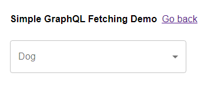

**Caching query result**

Khi chọn một item để bắt đầu query, data và ảnh sẽ được load từ nguồn khác

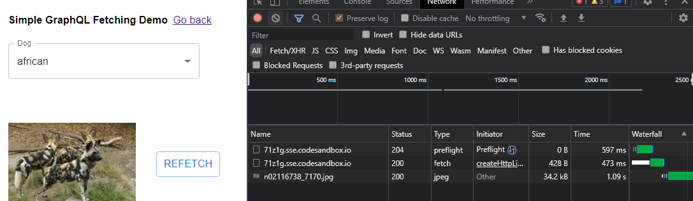

Chọn một item khác chưa được chọn từ trước, thì data và ảnh cũng sẽ được tải mới

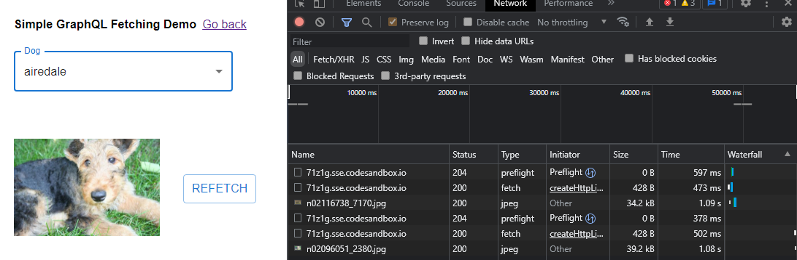

Khi chọn lại item cũ, data và ảnh sẽ được lấy ra từ disk cache mà không phải gọi đi bất cứ đâu

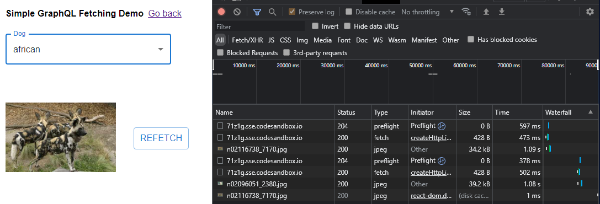

ta có thể sử dụng hàm **refect** được cung cấp từ **useQuery** Hook để có thể load lại query

**Lazy Query**

**useQuery** hook sẽ tự động thực hiện query mỗi khi componenet được khởi tạo <br />
Ta có thể sử dụng **useLazyQuery** để có thể query mỗi khi một sự kiện xảy ra, ví dụ như **onClick**

```javascript
import React from "react";

import { useLazyQuery } from "@apollo/client";

function DelayedQuery() {
  const [getDog, { loading, error, data }] = useLazyQuery(GET_DOG_PHOTO);

  if (loading) return <p>Loading ...</p>;
  if (error) return `Error! ${error}`;

  return (
    <div>
      {data?.dog && }

      <button onClick={() => getDog({ variables: { breed: "bulldog" } })}>
        Click me!
      </button>
    </div>
  );
}
```

**Mutation**
Mutation là phương thức dùng để tác động đến data như thêm, sửa , xoá data với **useMutation** hook

```javascript
const GET_TODOS = gql`
  {
    todos {
      id
      type
    }
  }
`;

const UPDATE_TODO = gql`
  mutation UpdateTodo($id: String!, $type: String!) {
    updateTodo(id: $id, type: $type) {
      id
      type
    }
  }
`;

const ADD_TODO = gql`
  mutation AddTodo($type: String!) {
    addTodo(type: $type) {
      id
      type
    }
  }
`;

//Add todo function
let input;
const [addTodo] = useMutation(ADD_TODO, {
  update(cache, { data: { addTodo } }) {
    cache.modify({
      fields: {
        todos(existingTodos = []) {
          const newTodoRef = cache.writeFragment({
            data: addTodo,
            fragment: gql`
              fragment NewTodo on Todo {
                id
                type
              }
            `,
          });
          return existingTodos.concat(newTodoRef);
        },
      },
    });
  },
});

//Update todo function
const { loading, error, data } = useQuery(GET_TODOS);
const [updateTodo, { loading: mutationLoading, error: mutationError, reset }] =
  useMutation(UPDATE_TODO);

updateTodo({ variables: { id, type: input.value } });
```

Add một todo mới với variable type là "todo #1"
<br />
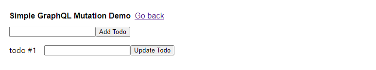
Request sẽ được gửi đi với payload
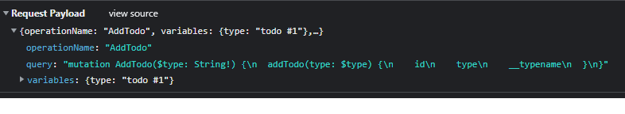

Để sửa tên một todo item, ta truyền một query mutation với variables là id của todo item đó và type mới
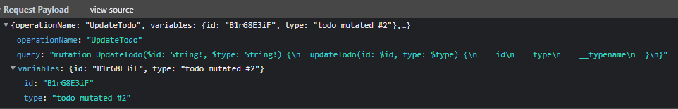
UI sẽ tự động cập nhật lại khi query thực hiện thành công
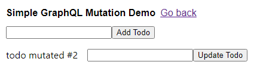

ta cũng có thể sử dụng hàm **reset** được cung cấp bởi **useMutation** hook để đưa data về trạng thái trước lúc gọi query **mutation** hoặc về giá trị ban đầu của data

<br />
<br />
<br />
<br />
> Ngoài ra Apollo còn cung cấp các phương thức khác query như **subscription** để uan sát thay đổi data real-time từ database và cập nhật

```javascript
const COMMENTS_SUBSCRIPTION = gql`
  subscription OnCommentAdded($postID: ID!) {
    commentAdded(postID: $postID) {
      id
      content
    }
  }
`;
```

**Pagination**

Ta có thể cài đặt phân trang với GraphQL tại Apollo Client thông qua cài đặt variables tại **useQuery** hook
<br />

```javascript
const FEED_QUERY = gql`
  query Feed($offset: Int, $limit: Int) {
    feed(offset: $offset, limit: $limit) {
      id
      # ...
    }
  }
`;

const FeedWithData() {

  const { loading, data, fetchMore } = useQuery(FEED_QUERY, {
    variables: {
      offset: 0,
      limit: 10
    },
  });
  // ...continues below...
}
```

**useQuery** Hook cung cấp cho chúng ta hàm **fetchMore** , thưƠng sẽ được gọi khi người dùng trigger một event như _click_, hay _scroll_
<br />

**fetchMore** mặc định sẽ thực hiện lại query với các variables đã khai báo trong **useQuery**, nhưng ta có thể truyền variables mới vào

```javascript
const FeedWithData() {
// ...continuing from above...

if (loading) return 'Loading...';

return (
    <Feed
      entries={data.feed || []}

      onLoadMore={() => fetchMore({
        variables: {
          offset: data.feed.length
        },
      })}
    />
  );
}

```

**Local State**

Apollo client cung cấp một giải pháp quản lý state tự do theo bất cứ cách nào ta muốn , cho phép ta truy vấn giữa local , data remote, và cached data
<br />
Ta có thể cài truy vấn data từ cả local và remote ngay trong cùng một query

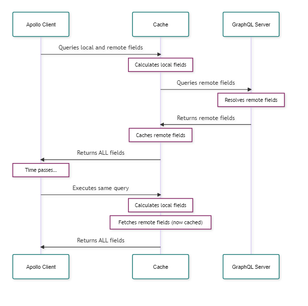

Định nghĩa trường được lấy từ local của một object thông qua typePolicies
<br />

Mỗi khi ta thực hiện một Query có chứa hànm read _read_, cache gọi query sẽ tính toán giá trị của trường đó
<br />
Dưới đây ta cung cấp một hàm _read_ chính là hàm đọc ra trường isInCart của object **Product** từ localStorate
<br />

```javascript
const cache = new InMemoryCache({
  typePolicies: {
    // Type policy map
    Product: {
      fields: {
        // Field policy map for the Product type
        isInCart: {
          // Field policy for the isInCart field
          read(_, { variables }) {
            // The read function for the isInCart field
            return localStorage.getItem("CART").includes(variables.productId);
          },
        },
      },
    },
  },
});
```

Ta cũng có thể tạo các **Schema** tại Client-side với _typeDefs_

```javascript
import { ApolloClient, InMemoryCache, gql } from "@apollo/client";

const typeDefs = gql`
  extend type Query {
    isLoggedIn: Boolean!
    cartItems: [Launch]!
  }

  extend type Launch {
    isInCart: Boolean!
  }

  extend type Mutation {
    addOrRemoveFromCart(id: ID!): [Launch]
  }
`;

const client = new ApolloClient({
  cache: new InMemoryCache(),
  uri: "/...",
  typeDefs,
});
```
