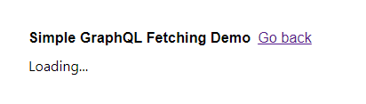
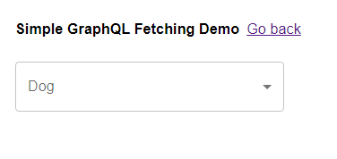
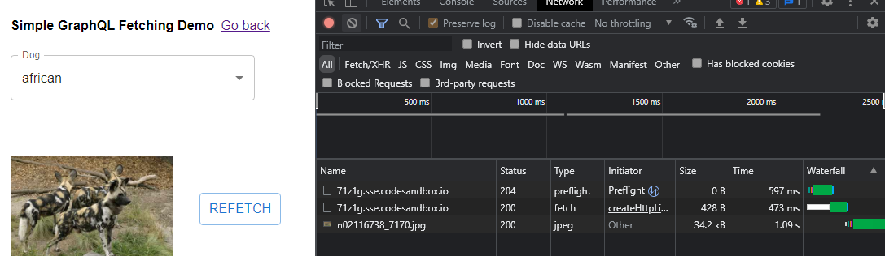
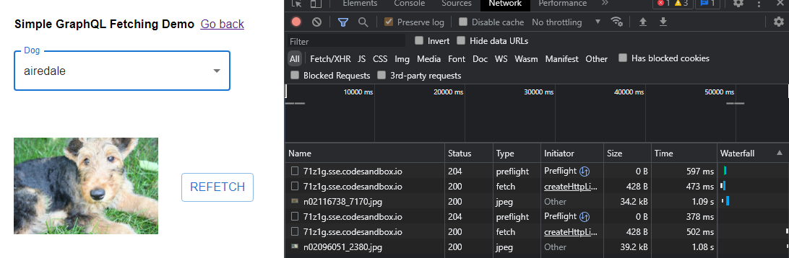
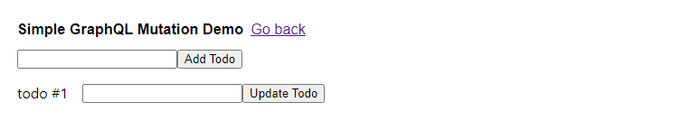

## **Apollo Client**

Apollo CLient là một thư viện quản lý dữ liệu toàn diện cho Javascript , cho phép chúng ta quản lý dữ liệu tại local và server trong khi tự động cập nhật UI

### **Để chạy client demo**

```bash
> cd client
> yarn install
> yarn start
```

## 1. Usage

### **Declarative data fetching**

Apollo client cung cấp toàn bộ các logic cho việc nhận data, trạng thái loading của data, trạng thái lỗi và cập nhật lại data gói gọn trong **useQuery** Hook

```javascript
function Feed() {
  const { loading, error, data } = useQuery(GET_DOGS);
  if (error) return <Error />;
  if (loading) return <Fetching />;

  return <DogList dogs={data.dogs} />;
}
```

### **Zero-config caching**

Apollo client cung cấp một hệ thống Cache thông minh rất dễ dàng tiếp cận, giảm thiếu sự rườm rà khi cài đặt

```javascript
import { ApolloClient, InMemoryCache, ApolloProvider } from "@apollo/client";

const client = new ApolloClient({
  cache: new InMemoryCache(),
});
function App() {
  return (
    <ApolloProvider client={client}>
      <Component />
    </ApolloProvider>
  );
}
```

### **Combine local & remote data**

Quản lý dữ liệu với Apollo Client cho phép chúng ta lợi dụng sự thống nhất tất cả data của GraphQL, cho phép chúng ta truy cập và truy vấn data từ ngay tại local và remote cùng một lúc với tag **@client** với những field chỉ có tại client

```javascript
const GET_DOG = gql`
  query GetDogByBreed($breed: String!) {
    dog(breed: $breed) {
      images {
        url
        id
        isLiked @client
      }
    }
  }
`;
```

## 2. Get Started with Simple Apollo Usage

### **Fetching Data**

Đê thực hiện một query, đầu tiên ta tạo một GraphQL query **GET_DOGS** được bao trong function **gql** để được parse ra thành query document

```javascript
import { gql, useQuery } from "@apollo/client";

const GET_DOGS = gql`
  query GetDogs {
    dogs {
      id
      breed
    }
  }
`;
```

Sau đó ta truyền **GET_DOGS** query tới **useQuery** Hook trong Component để tiến hành lấy dữ liệu

```javascript
function Dogs({ onDogSelected, selectedDog }) {
  const { loading, error, data } = useQuery(GET_DOGS);

  if (loading) return "Loading...";
  if (error) return `Error! ${error.message}`;

  return (
    <FormControl fullWidth sx={{ marginTop: 2 }}>
      <InputLabel id="demo-simple-select-label">Dog</InputLabel>
      <Select
        labelId="demo-simple-select-label"
        id="demo-simple-select"
        name="dog"
        label="Dog"
        onChange={onDogSelected}
        sx={{ maxWidth: 300 }}
      >
        {data.dogs.map((dog) => (
          <MenuItem key={dog.id} value={dog.breed}>
            {dog.breed}
          </MenuItem>
        ))}
      </Select>
    </FormControl>
  );
}
```

Mỗi khi các biến loading, error, và data thay đổi, Componenet Dogs sẽ được cập nhật tự động dựa trên các dữ liệu từ **useQuery** Hook




**Caching query result**

Khi chọn một item để bắt đầu query, data và ảnh sẽ được load từ nguồn khác



Chọn một item khác chưa được chọn từ trước, thì data và ảnh cũng sẽ được tải mới



Khi chọn lại item cũ, data và ảnh sẽ được lấy ra từ disk cache mà không phải gọi đi bất cứ đâu


ta có thể sử dụng hàm **refect** được cung cấp từ **useQuery** Hook để có thể load lại query

**Lazy Query**

**useQuery** hook sẽ tự động thực hiện query mỗi khi componenet được khởi tạo <br />
Ta có thể sử dụng **useLazyQuery** để có thể query mỗi khi một sự kiện xảy ra, ví dụ như **onClick**

```javascript
import React from "react";

import { useLazyQuery } from "@apollo/client";

function DelayedQuery() {
  const [getDog, { loading, error, data }] = useLazyQuery(GET_DOG_PHOTO);

  if (loading) return <p>Loading ...</p>;
  if (error) return `Error! ${error}`;

  return (
    <div>
      {data?.dog && }

      <button onClick={() => getDog({ variables: { breed: "bulldog" } })}>
        Click me!
      </button>
    </div>
  );
}
```

**Mutation**
Mutation là phương thức dùng để tác động đến data như thêm, sửa , xoá data với **useMutation** hook

```javascript
const GET_TODOS = gql`
  {
    todos {
      id
      type
    }
  }
`;

const UPDATE_TODO = gql`
  mutation UpdateTodo($id: String!, $type: String!) {
    updateTodo(id: $id, type: $type) {
      id
      type
    }
  }
`;

const ADD_TODO = gql`
  mutation AddTodo($type: String!) {
    addTodo(type: $type) {
      id
      type
    }
  }
`;

//Add todo function
let input;
const [addTodo] = useMutation(ADD_TODO, {
  update(cache, { data: { addTodo } }) {
    cache.modify({
      fields: {
        todos(existingTodos = []) {
          const newTodoRef = cache.writeFragment({
            data: addTodo,
            fragment: gql`
              fragment NewTodo on Todo {
                id
                type
              }
            `,
          });
          return existingTodos.concat(newTodoRef);
        },
      },
    });
  },
});

//Update todo function
const { loading, error, data } = useQuery(GET_TODOS);
const [updateTodo, { loading: mutationLoading, error: mutationError, reset }] =
  useMutation(UPDATE_TODO);

updateTodo({ variables: { id, type: input.value } });
```

Add một todo mới với variable type là "todo #1"
<br />

Request sẽ được gửi đi với payload


Để sửa tên một todo item, ta truyền một query mutation với variables là id của todo item đó và type mới

UI sẽ tự động cập nhật lại khi query thực hiện thành công


ta cũng có thể sử dụng hàm **reset** được cung cấp bởi **useMutation** hook để đưa data về trạng thái trước lúc gọi query **mutation** hoặc về giá trị ban đầu của data

<br />
<br />
<br />
<br />
> Ngoài ra Apollo còn cung cấp các phương thức khác query như **subscription** để uan sát thay đổi data real-time từ database và cập nhật

```javascript
const COMMENTS_SUBSCRIPTION = gql`
  subscription OnCommentAdded($postID: ID!) {
    commentAdded(postID: $postID) {
      id
      content
    }
  }
`;
```

**Pagination**

Ta có thể cài đặt phân trang với GraphQL tại Apollo Client thông qua cài đặt variables tại **useQuery** hook
<br />

```javascript
const FEED_QUERY = gql`
  query Feed($offset: Int, $limit: Int) {
    feed(offset: $offset, limit: $limit) {
      id
      # ...
    }
  }
`;

const FeedWithData() {

  const { loading, data, fetchMore } = useQuery(FEED_QUERY, {
    variables: {
      offset: 0,
      limit: 10
    },
  });
  // ...continues below...
}
```

**useQuery** Hook cung cấp cho chúng ta hàm **fetchMore** , thưƠng sẽ được gọi khi người dùng trigger một event như _click_, hay _scroll_
<br />

**fetchMore** mặc định sẽ thực hiện lại query với các variables đã khai báo trong **useQuery**, nhưng ta có thể truyền variables mới vào

```javascript
const FeedWithData() {
// ...continuing from above...

if (loading) return 'Loading...';

return (
    <Feed
      entries={data.feed || []}

      onLoadMore={() => fetchMore({
        variables: {
          offset: data.feed.length
        },
      })}
    />
  );
}

```

**Local State**

Apollo client cung cấp một giải pháp quản lý state tự do theo bất cứ cách nào ta muốn , cho phép ta truy vấn giữa local , data remote, và cached data
<br />
Ta có thể cài truy vấn data từ cả local và remote ngay trong cùng một query


Định nghĩa trường được lấy từ local của một object thông qua typePolicies
<br />

Mỗi khi ta thực hiện một Query có chứa hànm read _read_, cache gọi query sẽ tính toán giá trị của trường đó
<br />
Dưới đây ta cung cấp một hàm _read_ chính là hàm đọc ra trường isInCart của object **Product** từ localStorate
<br />

```javascript
const cache = new InMemoryCache({
  typePolicies: {
    // Type policy map
    Product: {
      fields: {
        // Field policy map for the Product type
        isInCart: {
          // Field policy for the isInCart field
          read(_, { variables }) {
            // The read function for the isInCart field
            return localStorage.getItem("CART").includes(variables.productId);
          },
        },
      },
    },
  },
});
```

Ta cũng có thể tạo các **Schema** tại Client-side với _typeDefs_

```javascript
import { ApolloClient, InMemoryCache, gql } from "@apollo/client";

const typeDefs = gql`
  extend type Query {
    isLoggedIn: Boolean!
    cartItems: [Launch]!
  }

  extend type Launch {
    isInCart: Boolean!
  }

  extend type Mutation {
    addOrRemoveFromCart(id: ID!): [Launch]
  }
`;

const client = new ApolloClient({
  cache: new InMemoryCache(),
  uri: "/...",
  typeDefs,
});
```
